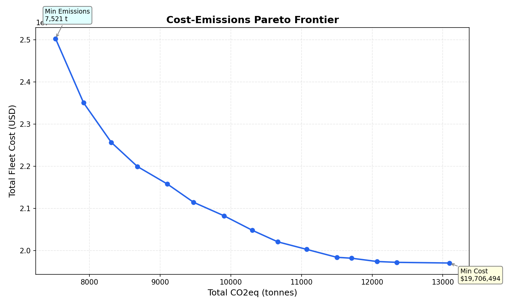
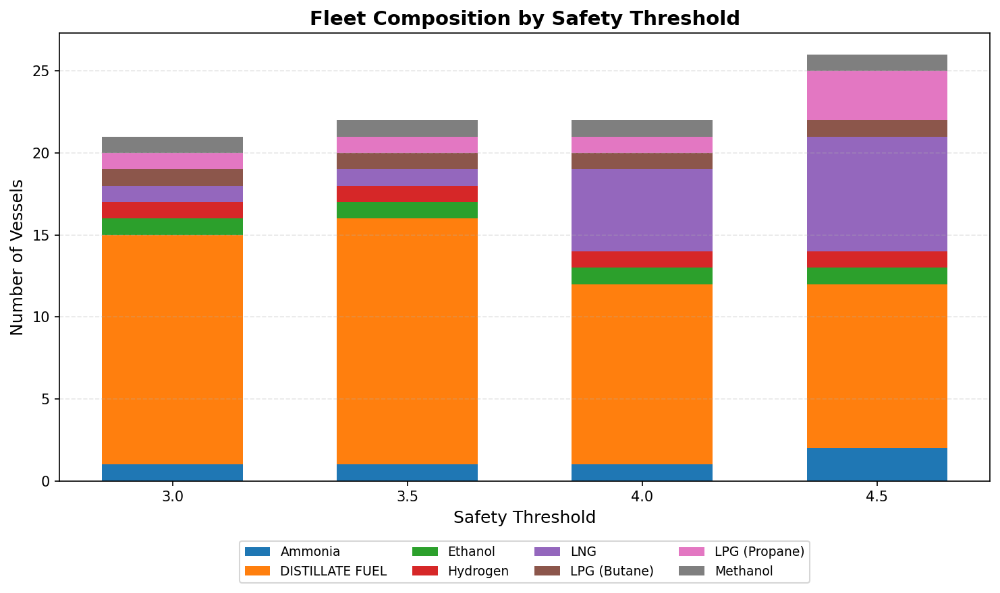
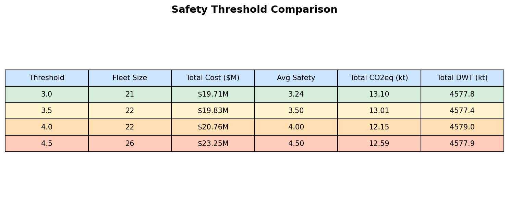
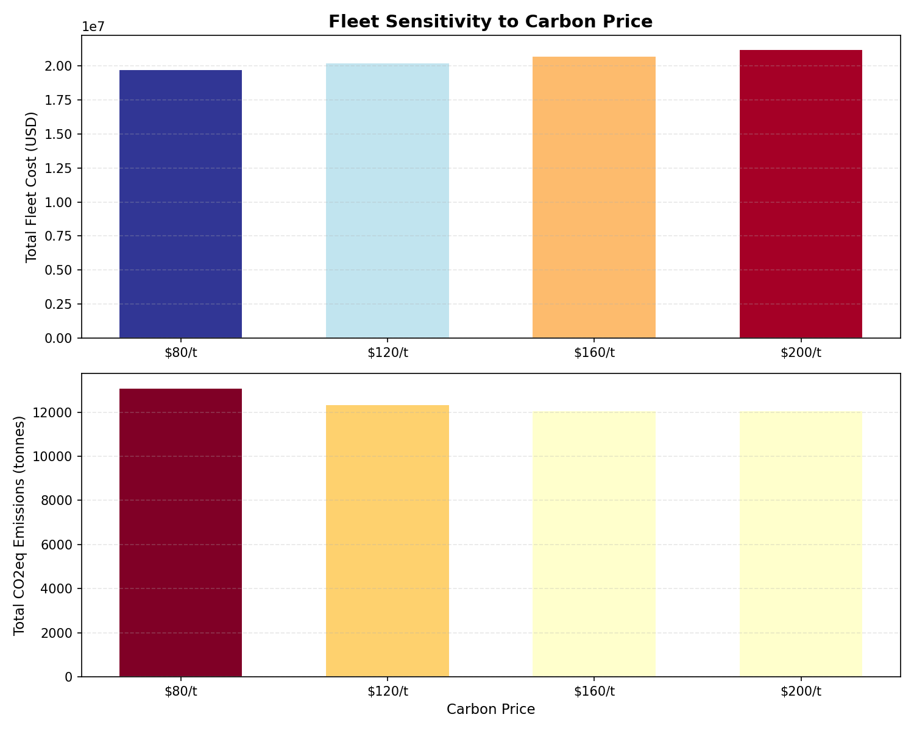
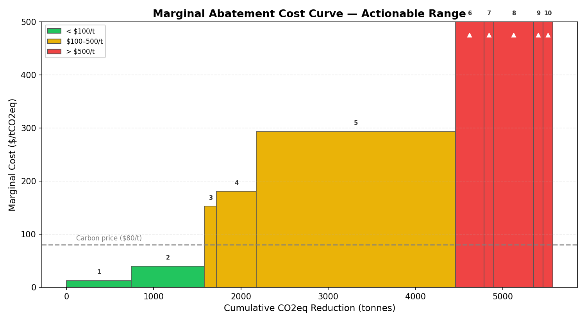

# Smart Fleet Selection: MILP-Based Optimization for Singapore-Australia Bunker Transport

**Team:** REPmonkeys | **Category:** A | **Maritime Hackathon 2026** | February 2026

---

## 1. Problem Statement & Approach

### Problem Definition

Singapore bunkered 54.92 million tonnes of marine fuel in 2024 (MPA Annual Report, p. 10), yielding a monthly demand of approximately 4,576,667 tonnes. This paper addresses the fleet selection problem: choose a minimum-cost subset of 108 Chemical/Products Tankers to transport bunker fuel from Singapore to Port Hedland (Australia West Coast) in a single monthly cycle, subject to four constraints:

1. **Demand coverage:** Combined fleet DWT >= 4,576,667 tonnes.
2. **Safety standard:** Weighted average fleet safety score >= 3.0 (scale: 1 = highest risk, 5 = least risk).
3. **Fuel diversity:** At least one vessel representing each of the 8 main engine fuel types (Distillate, LNG, Methanol, Ethanol, Ammonia, Hydrogen, LPG Propane, LPG Butane).
4. **Single use:** Each vessel selected at most once (no return trips within the month).

The total cost per vessel comprises fuel cost (main engine, auxiliary engine, and boiler), carbon cost (CO2-equivalent emissions at $80/tCO2eq), amortized monthly ownership cost (CAPEX with CRF = 0.0888, 30-year life, 8% discount rate, 10% salvage), and a risk premium tied to safety score (ranging from +10% for score 1 to -5% for score 5).

### Optimization Approach

We formulate the problem as a Mixed-Integer Linear Program (MILP) using the PuLP solver (CBC backend). Each vessel *i* has a binary decision variable *x_i* in {0, 1}. The objective minimizes total fleet cost:

> min SUM(x_i * final_cost_i)

The safety constraint is linearized to avoid a nonlinear average: SUM(x_i * (safety_i - 3.0)) >= 0, which is algebraically equivalent to requiring the weighted average safety score to meet or exceed the threshold. This formulation guarantees a provably optimal solution, unlike greedy or heuristic approaches that risk suboptimality. An optional CO2-equivalent emissions cap enables Pareto frontier analysis via the epsilon-constraint method.

---

## 2. Results & Sensitivity Analysis

### Base Case

The cost-minimizing MILP selects **21** vessels with a total cost of **$19,706,493.72**, aggregate DWT of **4,577,756** tonnes, average safety score of **3.24**, all **8** fuel types represented, total CO2-equivalent emissions of **13,095.28** tonnes, and total fuel consumption of **4,599.57** tonnes. The solver confirms optimality status, meaning no feasible fleet exists at lower cost.

### Cost-Emissions Pareto Frontier

A 15-point epsilon-constraint sweep tightens the CO2eq cap from the base case (13,095.28 tonnes) to the minimum achievable (7,521.49 tonnes), re-solving the MILP at each step. The resulting Pareto frontier (Figure 1) reveals the cost-emissions tradeoff: initial CO2 reductions are achievable at moderate cost, but aggressive decarbonization incurs sharply increasing marginal abatement costs. Shadow carbon prices between consecutive Pareto points range from $21.44/tCO2eq to $3,839.04/tCO2eq.

*Figure 1: Cost vs. CO2eq Pareto frontier (15-point epsilon-constraint sweep).*

### Safety Threshold Sensitivity

Re-running the MILP at thresholds of 3.0, 3.5, 4.0, and 4.5 quantifies the cost of higher safety standards. At threshold 3.0, the fleet costs $19,706,493.72; at 4.0, cost rises to $20,763,959.78 (a 5.4% increase), as the solver substitutes cheaper low-safety vessels with costlier high-safety alternatives. Threshold 4.5 is feasible at cost $23,251,571.47 (Figure 2, Figure 3).

*Figure 2: Fleet composition by fuel type across safety thresholds.*

*Figure 3: Fleet metrics comparison across safety thresholds.*

### Shadow Prices

Constraint perturbation analysis yields two shadow prices:
- **DWT demand (+1%):** $4.19/tonne additional capacity, reflecting the marginal cost of tightening the demand constraint.
- **Safety threshold (+0.1):** $0.00 per 0.1-point safety increase.

### Fuel Diversity What-If

Removing the fuel diversity constraint reduces cost by $1,116,062.40 (5.7%), as the solver drops 5 niche fuel types. This quantifies the cost of supply-chain resilience through fuel diversification.

---

## 3. Beyond the Brief

### Carbon Price Sensitivity

A sweep across carbon prices of $80, $120, $160, and $200 per tCO2eq recalculates each vessel's final cost and re-optimizes the fleet. At $80 (base), total cost is $19,706,493.72; at $200, cost rises to $21,190,674.31. Higher carbon pricing shifts fleet composition toward lower-emission vessels (e.g., Ammonia, Hydrogen), demonstrating that carbon pricing is an effective policy lever for fleet decarbonization (Figure 4).

*Figure 4: Fleet cost and emissions across carbon price scenarios ($80-$200/tCO2eq).*

### Marginal Abatement Cost Curve

The MACC (Figure 5), derived from Pareto frontier shadow carbon prices, ranks abatement opportunities by cost. Bars below the $80/tCO2eq reference line represent emissions reductions that are cost-effective under current carbon pricing. The curve identifies 2 abatement tranches below the reference price and 12 tranches requiring higher carbon pricing to justify.

*Figure 5: Marginal Abatement Cost Curve derived from Pareto frontier data.*

### Fleet Efficiency Metrics

The optimal fleet achieves a cost intensity of $4.3048/tDWT, an emissions intensity of 0.002861 tCO2eq/tDWT, an average vessel capacity of 217,988 tonnes, and a capacity utilization ratio of 100.02% (DWT / demand).

### Policy Implications

1. **Safety regulation:** Raising the safety threshold from 3.0 to 4.0 increases fleet cost by approximately 5.4%, suggesting that moderate safety improvements are achievable without prohibitive expense.
2. **Carbon pricing:** Fleet composition is sensitive to carbon price above $120/tCO2eq, where alternative fuels become competitive.
3. **Fuel diversity mandates:** Requiring all 8 fuel types adds $1,116,062.40 to fleet cost but ensures operational resilience against fuel supply disruptions.

### Recommendation

The MILP-optimal fleet at base parameters provides the provably lowest-cost solution. For policymakers, the key finding is that moderate safety tightening (to 3.5 or 4.0) and carbon pricing ($120-$160/tCO2eq) can meaningfully improve fleet safety and emissions profiles at quantifiable and manageable cost premiums. The epsilon-constraint Pareto frontier and MACC provide a decision-support framework for evaluating cost-environment tradeoffs specific to this Singapore-Australia route.
